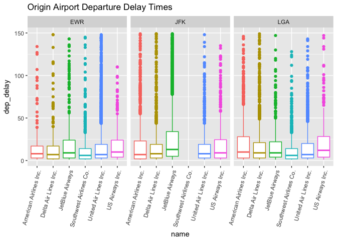
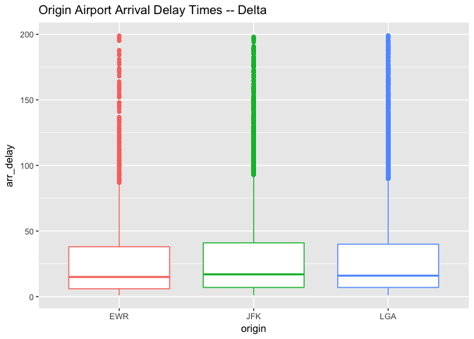
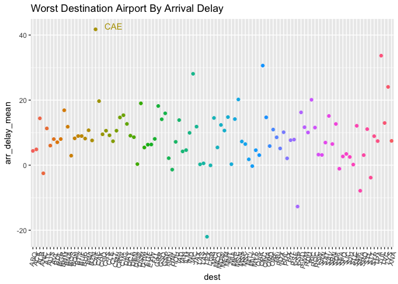

# Be On Time For Your Flight
McKay Davis  


## Background

In response to a few questions about airports, departure times, and arrival times, data from the R package `nycflights13` is graphically analyzed below. 1. Results indicate that in a flight that leaves before noon, the best two airlines to fly out of JFK are Delta and American, out of LGA are Southwest and United, and out of EWR are Southwest and Delta. 2. When using Delta Airlines, in order to minimize the chances of a late arrival, one should fly out of EWR. 3. Finally, overall the worst airport for arrival time is CAE with an average arrival delay of over 40 minutes.

## Response 1


```r
flights_noon <- subset(flights, dep_time < 1200)
bill <- merge(flights_noon, airlines)
flights_airline_noon <- subset(bill, name == "American Airlines Inc." | name == "Delta Air Lines Inc." | name == "JetBlue Airways" | name == "Southwest Airlines Co." | name == "United Air Lines Inc." | name == "US Airways Inc.")

ggplot(data = subset(flights_airline_noon, dep_delay < 150 & dep_delay > 0), aes(x = name, y = dep_delay, col = name)) +
  geom_boxplot(show.legend = F)  +
  theme(axis.text.x = element_text(angle = 75, vjust = 1, hjust = 1)) +
  facet_wrap(~origin, ncol = 4) +
  labs(title = "Origin Airport Departure Delay Times")
```

<!-- -->

I left in only major airlines that travel to many naional airports as many others did not have a lot of observations and I assumed that the traveler would be wanting a variety of possible destinations within the US. I also removed negative delay times as they skew the distribution of positive delay times.

The plots are not extremely decisive, but through deduction I gave the airlines that would likely be best to fly.

## Response 2


```r
flights_airline <- merge(flights, airlines)
flights_airline_delta <- subset(flights_airline, name == "Delta Air Lines Inc.")

ggplot(data = subset(flights_airline_delta, arr_delay < 200 & arr_delay > 0), aes(x = origin, y = arr_delay, col = origin)) +
  geom_boxplot(show.legend = F) +
  labs(title = "Origin Airport Arrival Delay Times -- Delta")
```

<!-- -->

I removed negative delay times as they skew the distribution of positive delay times.

Again, this plot is not very decisive, but upon a close look, EWR appears to have a slightly lower arrival delay distribution than the other two airports.

## Response 3


```r
bob <- data.frame(arr_delay = flights$arr_delay, dest = flights$dest)
sally <- bob[complete.cases(bob), ]
arrivals <- aggregate(sally$arr_delay, list(sally$dest), mean)
colnames(arrivals) <- c("dest", "arr_delay_mean")

ggplot(data = arrivals, aes(x = dest, y = arr_delay_mean, col = dest)) + 
  geom_point(show.legend = F) + 
  geom_text(aes(label = ifelse(arr_delay_mean > 40,as.character(dest),'')),hjust = -.5, vjust = 0, show.legend = F) +
  theme(axis.text.x = element_text(angle = 75, vjust = 1, hjust = 1)) +
  labs(title = "Worst Destination Airport By Arrival Delay")
```

<!-- -->

In order to make the above graphic, I averaged the arrival delay times by destination airport. 

CAE is by far the worst airport to travel to based on average arrival delay.
