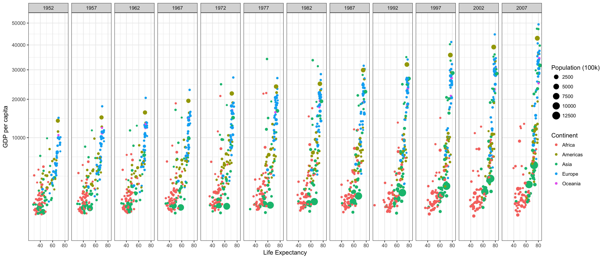
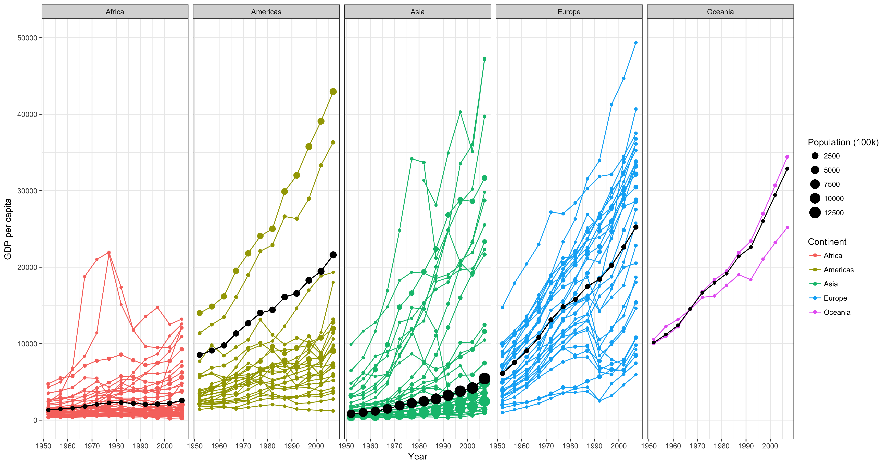

## Background

I learned some cool ways to group data in a graphical format to display information (facet_grid, col, group, size, x and y aesthetics, etc.) I also began to learn how to use dplyr.

## Images

