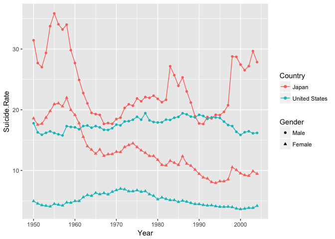

# Task 5: World Data Investigation
McKay Davis  


## Graphics


```r
suicides <- read.csv("~/Documents/git/Math_335/Case_Study_03/Class_Task_05/male-and-female-suicide-rate.csv", header = TRUE)

suicides1 <- subset(suicides, Entity == "United States" | Entity == "Japan")

colnames(suicides1) <- c("Country", "Code", "Year", "Male", "Female")

suicides1 <- gather(suicides1, Gender, Suicide.Rate, Male:Female, factor_key=TRUE)

ggplot(data = suicides1, aes(y = Suicide.Rate, x = Year, col = Country, shape = Gender)) +
  geom_point() +
  geom_line(aes(group = interaction(Country, Gender)))
```

<!-- -->

The above graphic shows suicide rates per Japan and the US over the years. It compares male and female suicide rates as well as rates between countries.


```r
ggplot(data = child_mortality, aes(y = child_mort, x = year, col = continent)) +
  geom_point(size = 0.05) +
  facet_grid(. ~ continent)
```

<!-- -->

The above graphic is a not so great attempt at the child mortality data. I was attempting to put it all on a map, but couldn't figure out that functionality. After a couple hours of work, I have determined to include this graphic which does give an overall idea of the downward trend in child mortality per 1000 children born.
