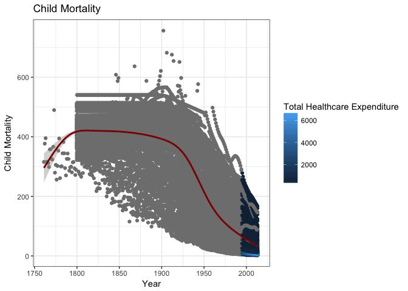
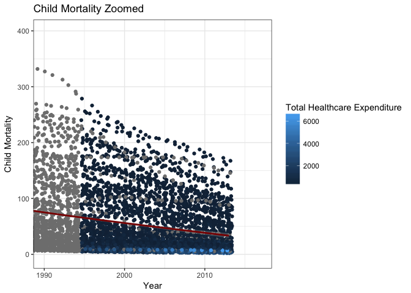

# Task 6: World Data Investigations - Part 2
McKay Davis  


## Background

Exploring child mortality, it may be useful to look at a country's healthcare expenditures. Here I look at child mortality when compared to year and the total amount expended on healthcare within each country. I believe it is unimportant at this time to know which country is which, but rather to simply look at the trend within amount expended on healthcare.


## Plots


```r
financing_healthcare %>%
  filter(country != "World") %>%
  rename(`Total Healthcare Expenditure` = health_exp_total, `Child Mortality` = child_mort, Year = year) %>%
  ggplot(aes(x = Year, y = `Child Mortality`, col = `Total Healthcare Expenditure`)) +
    geom_point()  +
    stat_smooth(color = "darkred") +
    theme_bw() +
    labs(title = "Child Mortality")
```

<!-- -->

The above plot shows an increase in child mortality from 1750 to 1800, most likely due to sparse and inaccurate data in the years between. From then on, a slow decline in mortality turns into a rapid one around 1920 aproximately when modern medicine began to pick up and be more widely used. As we can see, healthcare data is sparse up until about 1995, which leads us to our next plot, simply a zoomed in version of the one above.


```r
financing_healthcare %>%
  filter(country != "World") %>%
  rename(`Total Healthcare Expenditure` = health_exp_total, `Child Mortality` = child_mort, Year = year) %>%
  ggplot(aes(x = Year, y = `Child Mortality`, col = `Total Healthcare Expenditure`)) +
    geom_jitter()  +
    stat_smooth(color = "darkred") +
    coord_cartesian(x = c(1990, 2017), y = c(-5, 400)) +
    theme_bw() +
    labs(title = "Child Mortality Zoomed")
```

<!-- -->

The above plot is a zoomed in version of the first plot. It more clearly shows that the child mortality rate tends to be smaller in countries where there is more spent on healthcare. This is indicated by the lighter gradients being visible near the very bottom of the plot, while the darker gradients appear higher up. Based on the plots, it would be advisable for countries who wish to have a lower mortality rate, to spend more on healthcare.

