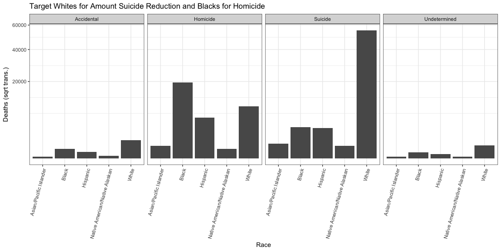

# Case Study 3: Reducing Gun Deaths (FiveThirtyEight)
McKay Davis  

### Background

The gist of the [article about gun deaths](http://www.cbsnews.com/pictures/controversial-police-shootings/) is that there are many more types of gun related deaths which actually contribute far more to total gun deaths than common media talks about. The main contributor is suicide which takes the lives of mostly white males. Another contributor is homicides committed by police officers which mostly affects males again.

 

The above plot shows each race, death intent, and season in which gun related deaths occured. It's plain to see that large contributors to gun related deaths are suicide in the white population and homicide in the black population. Both of which are highest in the summer.

 

Based on the above plot, commercials would do well to be presented on accidental related deaths in the winter, homicide related deaths in the summer, and suicide in the spring and summer.

 

This plot indicates the target audiences of the commercials. Accidental deaths are primarily a concern in the white population. Homicide related deaths are a problem mostly in the black population but also have a great presence in white and hispanic populations. Suicide related deaths are greatly present among the white population which far out-shadows the others.

 

### Notes

Perhaps we don't care about number of deaths and should be looking at proportional number of deaths. 

We may wish to compare the race of the people committing violence as well as those receiving it.

