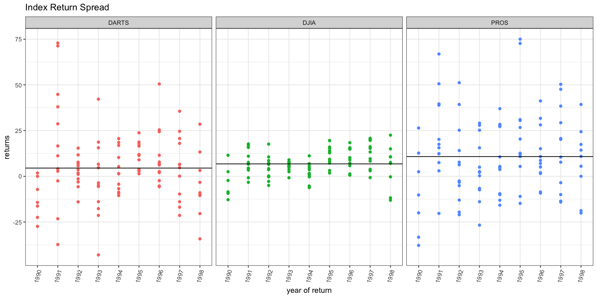
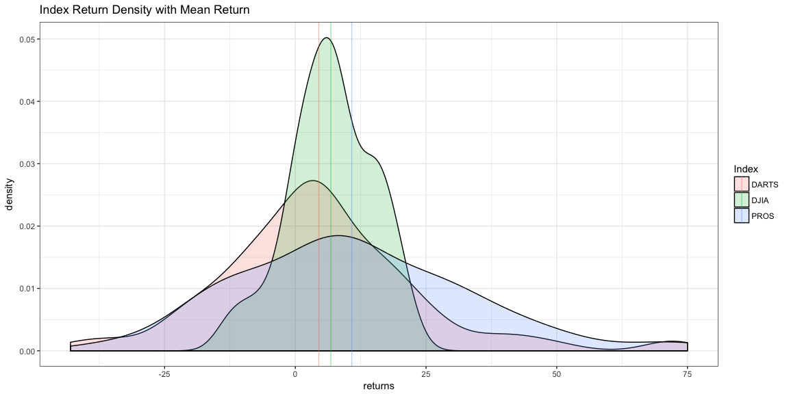

# Task 8: Clean and Reformat (aka tidy)
McKay Davis  


```r
knitr::opts_chunk$set(warning = FALSE, message = FALSE, fig.align = 'center', fig.width = 12, fig.height = 6)

library(readr)
library(readxl)
library(haven)
library(downloader)
library(tidyverse)

# read data
dowRds <- read_rds(gzcon(url("https://github.com/byuistats/data/raw/master/Dart_Expert_Dow_6month_anova/Dart_Expert_Dow_6month_anova.RDS")))

# create month end and year end columns and remove contest_period
tidyDowRds <- dowRds %>%
  separate(contest_period, into = c("rids","rids2"), sep = "-") %>%
  separate(rids2, into = c("month_end", "year_end"), sep = -5) %>%
  select(-one_of("rids"))
```


```r
tidyDowRds %>%
  filter(!is.na(year_end)) %>%
  ggplot(aes(y = value, x = year_end, col = variable)) +
    geom_point() +
    geom_hline(data = subset(tidyDowRds, is.na(year_end)), aes(yintercept = value)) +
    facet_grid(. ~ variable) +
    theme_bw() +
    theme(axis.text.x = element_text(angle = 75, vjust = 1, hjust = 1)) +
    theme(legend.position="none") +
    labs(y = "returns", x = "year of return", title = "Index Return Spread")
```



This plot displays the spread of index returns by each index. It also displays each index's mean to make spread per year more obvious. While PROS has the highest average return, it also seems to have the greatest variability. DJIA has the second highest mean and a much tighter distribution about it.

<hr/>


```r
# density curve w/ mean return
tidyDowRds %>%
ggplot(aes(x=value)) + 
  geom_density(alpha=.2, aes(fill = variable)) +
  geom_vline(data = subset(tidyDowRds, is.na(year_end)), aes(xintercept = value, col = variable), alpha = 0.4) +
  labs(y = "density", x = "returns", title = "Index Return Density with Mean Return", fill = "Index", col = "Index") +
  theme_bw()
```



This graphic gives an idea of the overall distribution of returns for each index. Again we get a feel for the tight distribution of DJIA returns and the loose distribution of PROS returns, while DARTS yeilds a fairly loose distribution as well, but with some outliers. The averages are also plotted for convenience in seeing the variability of means between indexes.

<hr/>


```r
# spread data with years as columns and months as rows
spreadTidyDowRds <- tidyDowRds %>%
  filter(variable == "DJIA" & !is.na(month_end)) %>%
  spread(key = year_end, value = value)

knitr::kable(spreadTidyDowRds)
```


month_end   variable     1990   1991   1992   1993   1994   1995   1996   1997    1998
----------  ---------  ------  -----  -----  -----  -----  -----  -----  -----  ------
April       DJIA           NA   16.2   10.6    5.8    0.5   12.8   14.8   15.3    22.5
August      DJIA         -2.3    4.4   -0.3    7.3    1.5   15.3    0.6    8.3   -13.1
Dec.        DJIA           NA     NA     NA    8.0     NA     NA     NA     NA      NA
December    DJIA         -9.3    6.6    0.2     NA    3.6    9.3   15.5   -0.7      NA
February    DJIA           NA   11.0    8.6    2.5    5.5     NA   15.6   20.1    10.7
Febuary     DJIA           NA     NA     NA     NA     NA    3.2     NA     NA      NA
January     DJIA           NA   -0.8    6.5   -0.8   11.2    1.8   15.0   19.6    -0.3
July        DJIA         11.5    7.6    4.2    3.7   -5.3   19.6    1.3   20.8     7.1
June        DJIA          2.5   17.7    3.6    7.7   -6.2   16.0   10.2   16.2    15.0
March       DJIA           NA   15.8    7.2    9.0    1.6    7.3   18.4    9.6     7.6
May         DJIA           NA   17.3   17.6    6.7    1.3   19.5    9.0   13.3    10.6
November    DJIA        -12.8   -3.3   -2.8    4.9   -0.3   13.1   15.1    3.8      NA
October     DJIA         -8.5    4.4   -5.0    5.7    6.9    8.2    7.2    3.0      NA
September   DJIA         -9.2    3.4   -0.1    5.2    4.4   14.0    5.8   20.2   -11.8

The above is a rearrangement of the data for the DJIA index only. It has `month_end` (or month of the six-month return) as rows and `year_end` (or year of the six-month return) as columns.

<br/>
