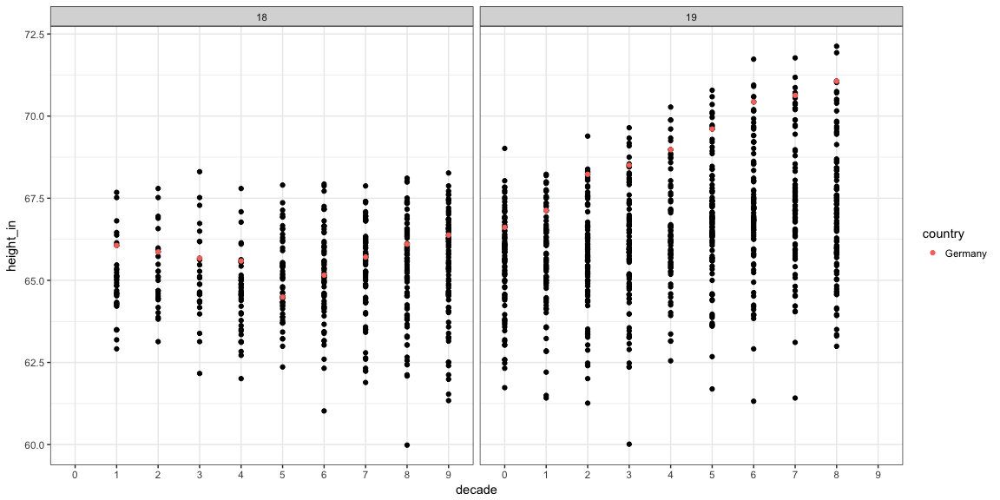
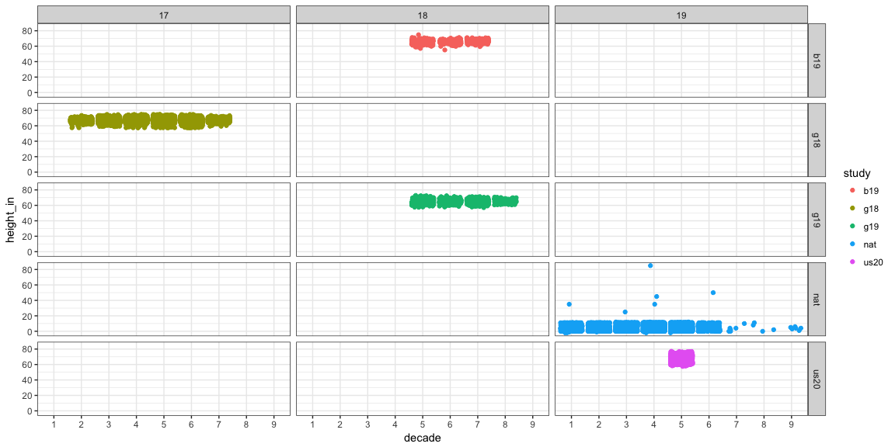

# Case Study 4: I can clean your data
McKay Davis  


```r
knitr::opts_chunk$set(warning = FALSE, message = FALSE, fig.align = 'center', fig.width = 12, fig.height = 6)

library(readxl)
library(haven)
library(tidyverse)
library(foreign)

heights <- read_rds("StudyHeights.Rds")
w20 <- read_rds("World20.Rds")
```

## Plots


```r
w201 <- subset(w20, century != 20)
w201 %>%
  ggplot(aes(y = height_in, x = decade)) +
    geom_point() +
    facet_grid(. ~ century) +
    geom_point(data = subset(w201, country %in% c("German", "Germany")), aes(col = country)) +
    theme_bw()
```



This plot shows the decade and height in inches on the axes and is split by century. Plotted in red are height observations for Germany. It is clear that there is an upward trend beginning in 1860 and continuing till 1980.


```r
heights %>%
  separate(birth_year, into = c("century", "decade", "year"), sep = c(2,3), remove = FALSE) %>%
  filter(decade != "-" & decade != "N") %>%
  ggplot(aes(y = height_in, x = decade, col = study)) +
    geom_jitter() +
    facet_grid(study ~ century) +
    theme_bw()
```



Here's an interesting plot where you may not see trend within groups, but accross groups it is apparent that average heights are different. The main takeaway from this plot is that the national survey heights are substantially lower than the rest, which indicates that there is probably something wrong with the data. Ideas:
1. The "feet" and "inches" column are supposed to be together as in 6'2"
  a. Problem: The max inches column is 85 which is about 7 feet and that        corresponding feet column says 5 feet, for a total of 12 feet tall.
2. The "feet" and "inches" columns are supposed to be the same measure.
  a. Problem: There are many many many measures where this does not add up.     eg. 5 feet does not equal 35 inches


