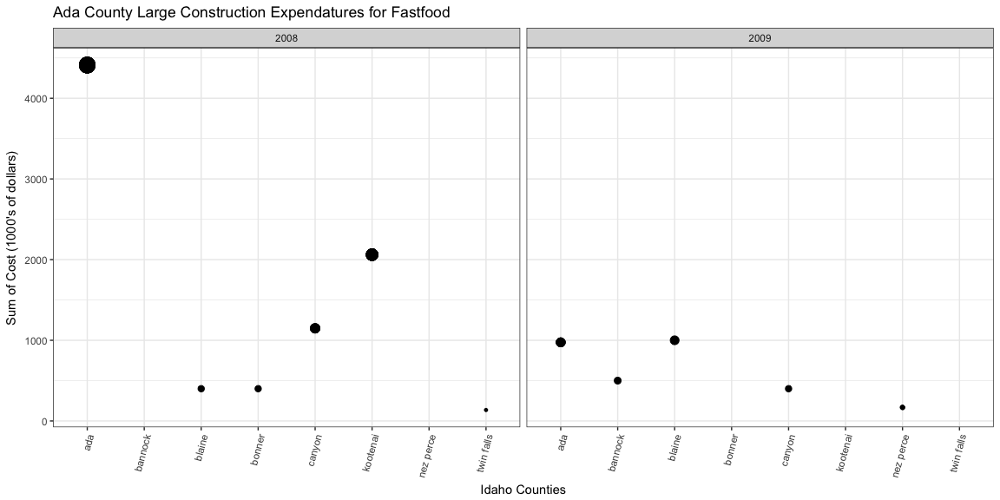

# Case Study 5: The collapse of construction in Idaho
McKay Davis {°_°}  


```r
knitr::opts_chunk$set(warning = FALSE, message = FALSE, fig.align = 'center', fig.width = 12, fig.height = 6)

library(buildings)
library(tidyverse)
library(stringr)
library(ggplot2)
library(ggthemes)
library(forcats)
```


```r
not_restaurants <- c("development","Food preperation center", "Food Services center","bakery","Grocery","conceession","Cafeteria", "lunchroom","school","facility"," hall ")
standalone_retail <- c("Wine","Spirits","Liquor","Convenience","drugstore","Flying J", "Rite Aid ","walgreens ","Love's Travel ")
full_service_type <- c("Ristorante","mexican","pizza ","steakhouse"," grill ","buffet","tavern"," bar ","waffle","italian","steak house")
quick_service_type <- c("coffee"," java "," Donut ","Doughnut"," burger ","Ice Cream ","custard ","sandwich ","fast food "," bagel ")


#Format df
rest <- climate_zone_fips %>%
  left_join(buildings0809, by = c("FIPS.county", "FIPS.state")) %>%
  filter(Type == "Food_Beverage_Service") %>%
  mutate_all(funs(tolower)) %>%
  mutate(construction_type = case_when(
    str_detect(ProjectTitle, "alteration") ~ "Alteration",
    str_detect(ProjectTitle, "addition") ~ "Addition",
    str_detect(ProjectTitle, "renov") ~ "Alteration",
    !(str_detect(ProjectTitle, paste(c("alteration", "addition"), collapse = "|"))) ~ "New"
  )) %>%
  mutate(restaurant_type = case_when(
    str_detect(ProjectTitle, paste(not_restaurants, collapse = "|")) ~ "Non_Restaurant",
    str_detect(ProjectTitle, paste(standalone_retail, collapse = "|")) ~ "Standalone_Retail",
    str_detect(ProjectTitle, paste(full_service_type, collapse = "|")) ~ "Full_Service",
    str_detect(ProjectTitle, paste(quick_service_type, collapse = "|")) ~ "Quick_Service",
    .$SqFt > 4000 & .$construction_type == "New" ~ "Full_Service",
    .$SqFt < 4000 & .$construction_type == "New" ~ "Quick_Service"
  )) %>%
  mutate(restaurant_type = ifelse(is.na(restaurant_type), "Unknown" ,restaurant_type)) %>%
  select(restaurant_type, construction_type, Value1000, AreaName, Year, Month, SqFt) %>%
  rename(value1000 = Value1000, county = AreaName, year = Year, month = Month, square_feet = SqFt) %>%
  mutate(building_type = case_when(
    str_detect(restaurant_type, paste(c("Non_Restaurant", "Standalone_Retail"), collapse = "|")) ~ "Not_Restaurant",
    str_detect(restaurant_type, paste(c("Full_Service", "Quick_Service"), collapse = "|")) ~ "Restaurant",
    str_detect(restaurant_type, "Unknown") ~ "Unknown"
  ))
rest$value1000 <- as.integer(rest$value1000)
rest$county <- gsub(" county", "", rest$county)
```

### Graphics


```r
#Sit-down vs Fast-food
rest %>%
  filter(restaurant_type %in% c("Full_Service", "Quick_Service")) %>%
  group_by(restaurant_type, county, year) %>%
  mutate(avval = mean(value1000)) %>%
  ggplot(aes(x = fct_reorder(county, value1000, .desc = TRUE), y = value1000, col = restaurant_type)) +
    geom_point(alpha = 0.6) +
    geom_point(aes(y = avval, col = restaurant_type), size = 2, shape = 5) +
    facet_grid(. ~ year) +
    theme_solarized_2(light = FALSE) +
    theme(axis.text.x = element_text(angle = 75, vjust = 1, hjust = 1)) +
    guides(color = guide_legend(override.aes = list(size = 5))) +
    labs(title = "Full Service With Greater Avg. Cost\nIn Counties Containing Both Types of Construction", y = "Cost (1000's of Dollars)", x = "County", color = "Restaurant Type")
```


Diamond shaped points represent averages in their respective county and Restaurant Type. Interesting note: Some counties only have one data point and so their average is the same as that point.
The above graphic shows that when a county has both fastfood and traditional sit-down restaurant construction, the sit-down traditional restaurants cost more on average to build.


```r
#Restaurant vs Not
rest %>%
  filter(building_type != "Unknown") %>%
  ggplot(aes(x = county, y = value1000, col = building_type)) +
  geom_point() +
  facet_grid(. ~ year) +
  theme_bw() +
  theme(axis.text.x = element_text(angle = 75, vjust = 1, hjust = 1)) +
  labs(title = "Restaurant Construction Cost Vastly\nLarger than Non-Restaurant in all Counties but Elmore",
       y = "Cost (1000's of Dollars)", x = "County", color = "Construction Type")
```


This graphic indicates that the construction cost in all counties but Elmore (which doesn't have Restaurant construction) is much higher for restaurants than for non-restaurant food related construction.


```r
#Fast-food
rest %>%
  filter(restaurant_type == "Quick_Service") %>%
  group_by(county, year) %>%
  mutate(sumval = sum(value1000)) %>%
  ggplot(aes(x = county, y = sumval, size = sumval)) +
  geom_point() +
  facet_grid(. ~ year) +
  theme_bw() +
  theme(axis.text.x = element_text(angle = 75, vjust = 1, hjust = 1)) +
  theme(legend.position = "none") +
  labs(title = "Ada County Large Construction Expendatures for Fastfood", y = "Sum of Cost (1000's of dollars)", x = "Idaho Counties")
```



Differing sizes in points in this graphic are purely put in place to make it obvious which costs are bigger. The bigger the cost, the bigger the point.
In this graphic we see that Ada County has the largest expendatures for fastfood construction in 2008 and the second highest in 2009.


```r
#Ada County
rest %>%
  filter(county == "ada") %>%
  group_by(year, restaurant_type) %>%
  mutate(avval = mean(value1000)) %>%
  ggplot(aes(x = restaurant_type, y = value1000)) +
  geom_point(alpha = .5) +
  geom_point(size = 2, color = "blue", aes(y = avval)) +
  facet_grid(. ~ year) +
  theme_bw() +
  theme(axis.text.x = element_text(angle = 75, vjust = 1, hjust = 1)) +
  labs(title = "Full Service Restaurants\nGreatest Average Construction Cost in Ada County", y = "Cost (1000's of Dollars)", x = "Type of Build")
```


In the above graphic, the larger blue points represent averages in their respective Type of Build.
In Ada County (the one that spends the most on fastfood construction), Full Service (or traditional sit-down restaurants) have the highest average cost out of any food related construction.
