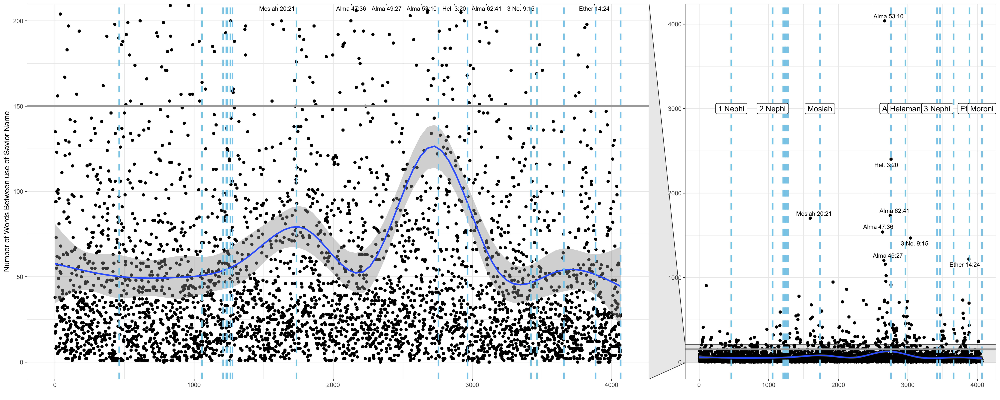

# Case Study 6: Counting names in scripture
McKay Davis  


```r
knitr::opts_chunk$set(warning = FALSE, message = FALSE, fig.align = 'center', fig.width = 12, fig.height = 6)
```



I just took brother hathaway's image and attempted to improve it with ggforce. I spent many hours trying to get the code right for this one to no avail.
