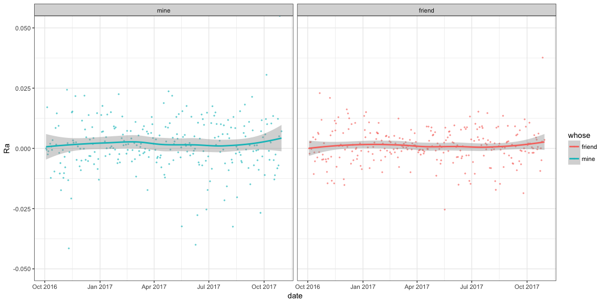
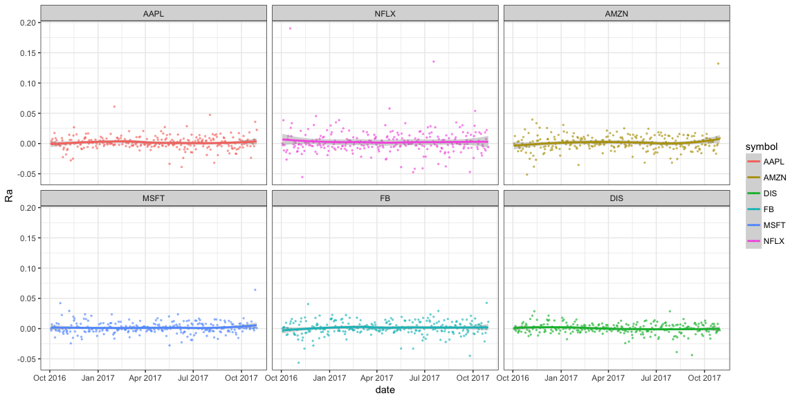

# Task 15: My investment is better than yours
McKay Davis  


```r
knitr::opts_chunk$set(warning = FALSE, message = FALSE, fig.align = 'center', fig.width = 12, fig.height = 6)
```


```r
library(tidyquant)
library(tidyverse)
library(quantmod)
library(lubridate)
library(forcats)

#Get stocks
wts <- c(1/3, 1/3, 1/3)

stock.mine.stock <- c("AAPL", "NFLX", "AMZN") %>% 
  tq_get(get = "stock.prices", from = "2016-10-01") %>% 
  group_by(symbol) %>% 
  tq_transmute(select = adjusted, mutate_fun = periodReturn, period = "daily", col_rename = "Ra") 

stock.mine.port <- stock.mine.stock %>% 
  tq_portfolio(assets_col = symbol, returns_col = Ra, weights = wts, col_rename = "Ra") %>% 
  mutate(whose = "mine")

stock.friend.stock <- c("MSFT", "FB", "DIS") %>% 
  tq_get(get = "stock.prices", from = "2016-10-01") %>% 
  group_by(symbol) %>% 
  tq_transmute(select = adjusted, mutate_fun = periodReturn, period = "daily", col_rename = "Ra")

stock.friend.port <- stock.friend.stock %>% 
  tq_portfolio(assets_col = symbol, returns_col = Ra, weights = wts, col_rename = "Ra") %>% 
  mutate(whose = "friend")


stock <- stock.mine.stock %>% 
  full_join(stock.friend.stock)

port <- stock.mine.port %>% 
  full_join(stock.friend.port)
```


```r
orders1 <- c("mine", "friend")
port %>% 
  ggplot(aes(y = Ra, x = date, col = whose)) +
    geom_point(size = .5, alpha = .5) +
    geom_smooth() +
    theme_bw() +
    facet_wrap( ~ factor(whose, levels = orders1)) +
    coord_cartesian(ylim = c(-0.05, 0.05))
```



This plot indicates that I am the winner. It's really not too different though it seems.


```r
orders2 <- c("AAPL", "NFLX", "AMZN", "MSFT", "FB", "DIS")
stock %>% 
  ggplot(aes(y = Ra, x = date, col = symbol)) +
    geom_point(size = .5, alpha = .5) +
    geom_smooth() +
    theme_bw() +
    facet_wrap( ~ factor(symbol, levels = orders2))
```



The increase in my stocks seems to be because of Amazon.
