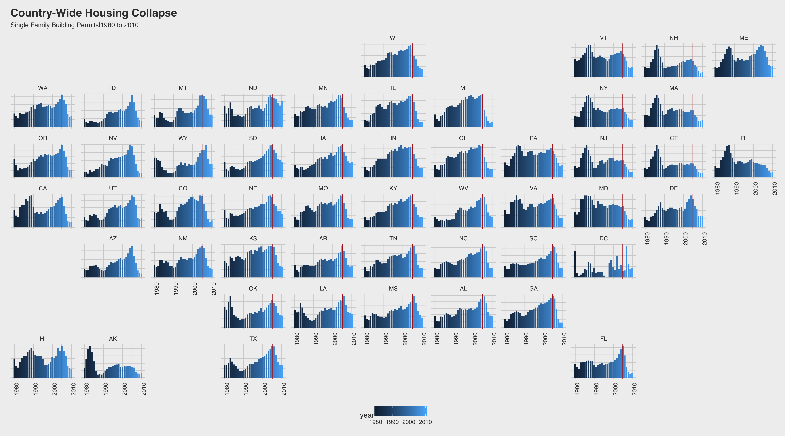
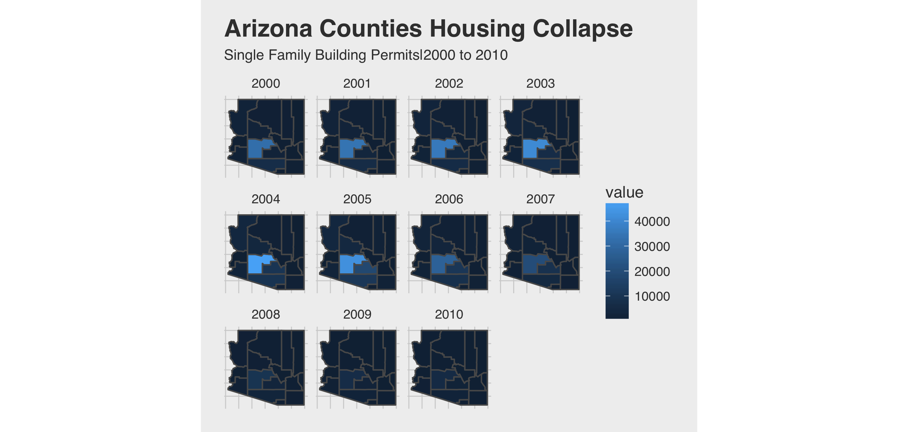

# Case Study 10: Building the past
McKay Davis  

##US Buildings

This plot shows the downturn in the housing market among single family homes around 2005 (indicated by the red line.) This is basically the same for all states except DC.

##AZ Buildings

Lighter areas are higher values. You can see how the housing values decrease from 2005 in arizona. It looks like property values are really only ever high in one county (Maricopa.)
